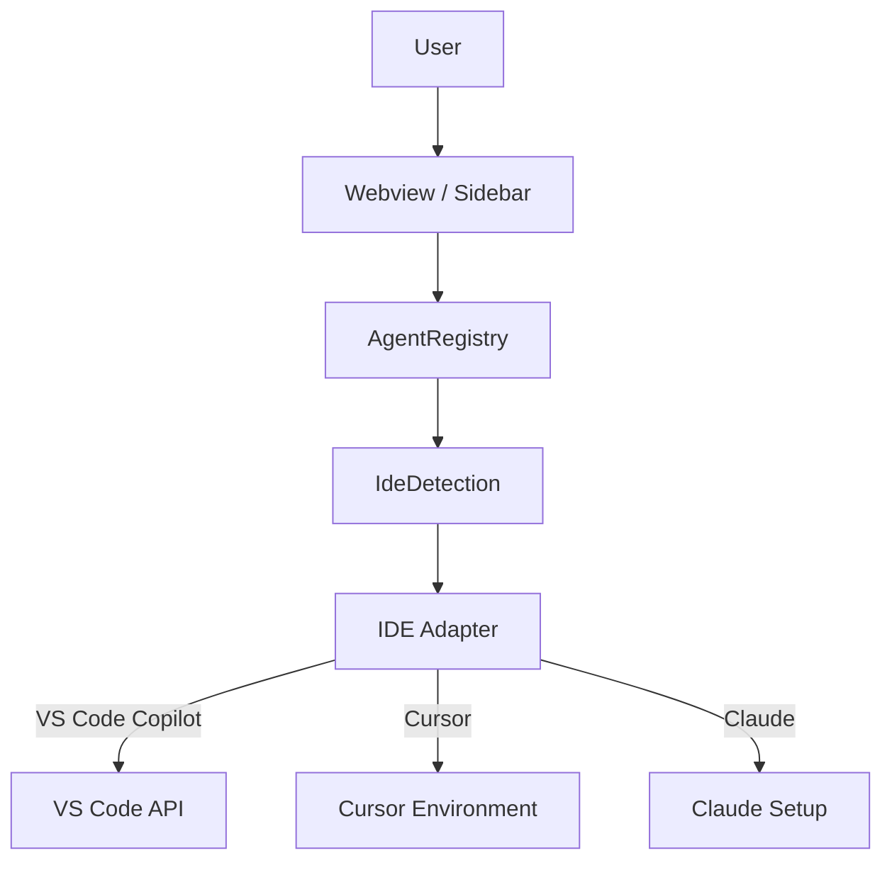

# AI Agent Hub

A cross-IDE AI Agent Hub that manages reusable coding agents and exposes them to different AI coding environments (e.g., VS Code/Copilot, Cursor, Claude).

## 1. What is AI Agent Hub?
AI Agent Hub is a VS Code extension that unifies AI agent management. You can define specific coding agents (e.g., Angular Agent, Python Agent) in a standardized JSON format, and the Hub acts as a registry. You can then invoke these agents in your available/supported IDE AI environments.

## 2. Architecture
The architecture is designed to be highly modular and decoupled from any specific IDE logic:


- **Core (Registry, Loader, Config, Events):** Only handles agent definitions and lifecycle.
- **Adapters Layer:** Interfaces with specific AI Assistants, checking environment status and (in the future) sending prompts directly through supported APIs.
- **Service/UI Layer:** Glues the UX with Core mechanisms. 

## 3. Agent Definition Format
An agent's definition contains its basic identity, instructions, and optional capabilities, structured in an `agent.json` file:
```json
{
    "id": "angular",
    "name": "Angular Agent",
    "description": "Enterprise Angular development assistant",
    "version": "1.0.0",
    "instructions": "Placeholder instructions for the Angular agent",
    "capabilities": [
        "angular-development"
    ]
}
```

## 4. How to Add a New Agent
Simply create a new directory inside `agents/examples/` (or your configured `aiAgentHub.agentsPath` directory) containing an `agent.json` file.
```
agents/
  └── new-agent/
      └── agent.json
```
Use the "AI Agent Hub: Refresh Agents" command within VS Code to dynamically load the new agent without restarting.

## 5. How Adapters Work
Adapters implement the `IdeAdapter` interface. They provide an `isAvailable()` detection method and endpoints (`sendAgent()`, `sendPrompt()`) for execution. The Core calls an adapter, which encapsulates IDE-specific API integrations or telemetry.

## 6. How to Run the Extension
1. Install dependencies: `npm install`
2. Compile everything: `npm run compile`
3. Press `F5` in VS Code, or choose the "Run Extension" configuration to start a new Extension Development Host window.

## 7. Current Limitations
- Phase 1 limits adapters to check existence and mock the log output. 
- Prompt injection/IDE integration is not fully automated since standardized APIs don't exist yet via Copilot extension boundaries (or Cursor/Claude internals).

## 8. Future MCP Architecture
In future phases, Model Context Protocol (MCP) will be integrated between the Agent Tools boundary and the IDE Adapters:
- `Agent Definition -> Integrations -> MCP Server -> External Workspaces (Jira, Web, Files, DB)`
This ensures complete isolation from immediate UI logic.

## 9. How to Implement New IDE Adapters
1. Create a class executing the `IdeAdapter` interface.
2. Provide detection logic in `isAvailable()`.
3. Add it to `src/services/IdeDetectionService.ts` within the constructor.
